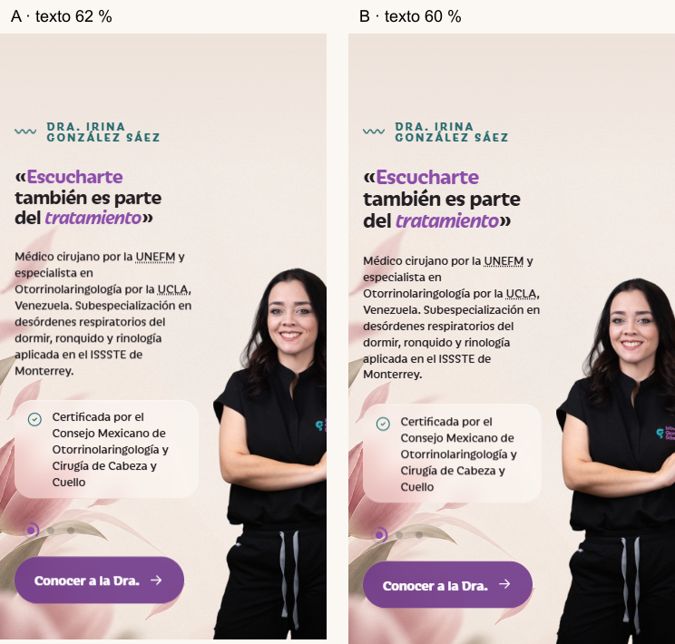
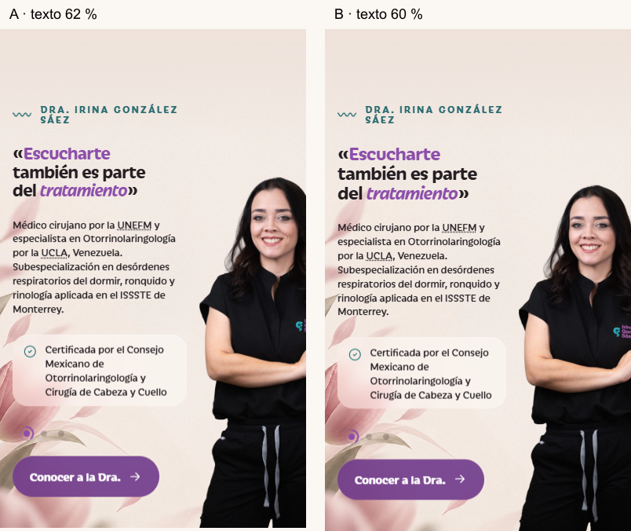

# Auditoría integral de Codex — 10 de octubre de 2026

Rama: `ccr-6254502d-xly8ww`. Base inspeccionada: `d04e2cd`. Cambios locales anteriores en cuatro HTML de `tools/preview/` preservados fuera de los commits. No hubo despliegue, envío de correo, publicación clínica, cambios de CDN ni operaciones sobre Sensia. Commits con identidad local `Codex <codex@localhost>` porque el checkout no tenía identidad Git configurada.

## Normalización y límites

El proyecto ya tiene tema, plugin, contenido generado, despliegue con respaldo y aprobación médica. La portada, Dra., Primera consulta, FAQ, Contacto, legales, Links y Gracias están públicas; los pilares y fichas siguen sin destino público. STATUS y los resúmenes de PLAN/NEXT/BATON describían etapas anteriores como estado actual. Se conserva el historial de decisiones; se separa el resultado local de la verificación en producción.

PLAN sí aporta base: 95 tareas españolas, 253 pesos, 25 DONE y 66 pesos completos. PROGRESS calcula **26,09 %** con el criterio solicitado: solo DONE suma. No es pérdida de trabajo: el 31 % anterior mezclaba revisión parcial y un resumen que no coincidía con las filas. Los DONE heredados conservan sus fuentes históricas; la revisión actual no certifica por sí sola todos los gates del proyecto.

Metodología: lectura de constitución, decisiones, diseño, arquitectura, SEO y operación; revisión de las superficies PHP/REST, aprobación, contacto, mini apps, scripts y builds; lint PHP/PHPCS, sintaxis JS/bash, comparación semántica de JSON; Chrome local público en seis anchos; variantes sobre **HTML publicado con CSS/JS locales interceptados**, sin modificar el servidor. La herramienta web no accedió al dominio; Chrome local sí.

Límites: sin credenciales ni sesión WP; no se probaron escrituras REST, rol real, mini app autenticada, SMTP, Search Console, hPanel ni restricciones efectivas en Google Cloud. No se certifica cumplimiento legal ni exactitud clínica: ambos requieren revisión de sus responsables. No se presume que los parches estén en producción.

## Hallazgos y acciones

No se identificó P0 en las superficies revisadas. `FIXED_LOCAL` significa probado localmente y pendiente de despliegue; `OPEN` identifica trabajo restante. QA contiene las referencias por archivo y la revisión de Q-001–Q-023.

| ID | Prioridad | Evidencia | Acción |
|---|---|---|---|
| Q-024 | P1 | Estado médico heredaba `assign_terms=edit_posts`; guard solo atendía `publish`; cambios de texto conservaban aprobación | Capacidades de aprobación en la taxonomía, bloqueo de `future`, nueva revisión tras cambios de editor técnico; regresión local |
| Q-025 | P1 | Diez destinos únicos de Home responden 404; `home-links.json` | Salida pública temporal a Primera consulta, resolución automática al publicarse el destino; sidebar clínico omite borradores |
| Q-026 | P2 | HTML público de Home/Dra. duplica `fetchpriority`; loading solo una copia en esta muestra | Normalización con API HTML de WP en helper y contenido Elementor; verificar tras purga |
| Q-027 | P2 | `performance.php` registraba calidad 100 y después 94 | Retirado filtro contradictorio |
| Q-028 | P1 | `upload-media.sh` borraba el adjunto antes de importar | Importar primero, conservar anterior con slug de archivo; sufijo con segundos, validación de argumentos y limpiar caché de imagen Physician |
| Q-029 | P1 | REST devuelve horario pese a `horario_oculto=true`; `public.json` | Omitir horario público cuando está oculto; Maps y Bcc ya se excluían |
| Q-030 | P2 | JSON Elementor en una línea | Indentación estable; tres builds regenerados, comparación semántica idéntica a base |
| Q-031 | P2 | STATUS/BATON desactualizados y cálculos divergentes | Panel actual, PROGRESS reproducible, NEXT por próximo paso, documentos históricos identificados |
| Q-032 | P2 | Altura de carrusel medida antes de fuentes y nunca al redimensionar; tocar sin deslizar no pausaba | Remedir tras fuentes/resize, pausa al tocar, sin anuncios automáticos cada 4 s; tres puntos y anillo conservados |
| Q-033 | P2 | Campos array podían producir avisos/fatal; JS no marcaba `aria-invalid` y permitía duplicar envío | Rechazo temprano, POST obligatorio, estado accesible y guard de envío; sin nonce por diseño de caché |
| Q-034 | P2 | JSON de mapa concatenado como JS sin codificar; JSON-LD sin protección de cierre script | Recodificación JSON y flags HEX; regresión de `</script>` |
| Q-035 | P2 | Mini apps conservaban código de correo y config existente; deploy imprimía token/respuestas | Sin correo aunque exista `notify`; lectura acotada, token tipado, error de almacenamiento; respaldo y URLs en archivo privado ignorado |
| Q-036 | P2 | Setup Dra./fallback SEO seguían consultando `name+any` | `post_name__in` en ambos; sintaxis validada, ejecución idempotente real pendiente |
| Q-037 | P2 | uninstall sin strict; `_` sin escapar en LIKE podía ampliar el borrado de transitorios | strict y consulta preparada con `esc_like`; contenido y ajustes conservados |
| Q-038 | P2 | Overline de Escucharte 4,1:1 sobre la foto | Teal más oscuro y glass púrpura con token fuerte; muestras AA locales |
| Q-039 | P1 | Sección de 851 px, rostro recortado a 360; baseline | Variante A implementada; elección visual de José y prueba en producción pendientes |
| Q-040 | P2 | Ops permite casi cualquier opción a `manage_options`, salvo denylist | Propuesta técnica: lista permitida tras inventariar consumidores; no ampliar Ops a archivos/SQL ni a Sensia |
| Q-041 | P2 | `google.maps.Marker` obsoleto, API funciona | OPEN: conservar hasta decidir mapId; corregida inicialización duplicada |
| Q-042 | P2 | Repetición de NAP/horarios/hospitales en builds y defaults de widgets | OPEN: migración futura a settings al renderizar; no reemplazar textos aprobados con cambios no revisados |
| Q-043 | P1 | Dra./Primera consulta publicadas muestran «Borrador: pendiente de revisión de la Dra.» (`draft=yes`) | OWNER: confirmar revisión real del bloque antes de retirar marca; no ocultarla para simular aprobación ni cambiar estados |

Los metadatos ahora autorizan `edit_post` sobre el ID concreto, en vez de `edit_posts` genérico. El cierre de Q-024 en un WordPress completo necesita comprobar REST/Gutenberg con rol técnico y revisora en staging. Los tests aislados demuestran la lógica, no sustituyen esos permisos reales.

## Escucharte — variantes A/B

Ambas conservan textos, proporción natural, retrato a la derecha sin translateX, gap de 16 px, fondo a `-8vw bottom`, recorte solo por viewport, botón en una línea y carrusel. Para recuperar el rostro se limita el ancho proporcional; la figura ya no tiene literalmente todo el alto del texto en móvil. Esta es la concesión geométrica prevista por las ideas del encargo: con altura 100 %, texto legible y gap fijo, el rostro vuelve a salir del viewport. José decide si acepta el tope. Escritorio 1440 mantiene la composición aprobada.

**A, implementada:** texto 62 %, imagen 155 % del espacio restante; cita `clamp(1.4rem,6vw,1.8rem)`. Más espacio de lectura, figura algo mayor y sección ligeramente más corta.

**B, alternativa:** texto 60 %, imagen 145 % del espacio restante; cita `clamp(1.5rem,6.3vw,1.8rem)`. Más espacio disponible a la figura y cita mayor, a cambio de unos 4 px extra de sección en móviles estrechos. CSS alternativo reproducible en `tools/audit/visual.cjs --local --variant=B`; no se carga en el sitio.

| Ancho | Alto actual | Alto A / B | Cita A/B | Párrafo A/B | Tarjeta A/B | Rostro A / B |
|---:|---:|---:|---:|---:|---:|---:|
| 360 | 851,1 | 668,1 / 672,8 | 3 / 3 | 8 / 8 | 108,6 / 108,6 | ≈98,6 % / 100 % |
| 390 | 829,0 | 635,3 / 638,8 | 3 / 3 | 7 / 7 | 90,8 / 90,8 | ≈98,6 % / 100 % |
| 414 | 756,0 | 628,4 / 632,1 | 3 / 3 | 7 / 7 | 90,8 / 90,8 | ≈98,6 % / 100 % |
| 430 | 756,0 | 633,3 / 637,2 | 3 / 3 | 7 / 7 | 90,8 / 90,8 | ≈98,6 % / 100 % |
| 483 | 689,7 | 610,4 / 610,4 | 3 / 3 | 6 / 6 | 72,9 / 72,9 | ≈98,6 % / 100 % |
| 1440 | 849,0 | 849,0 / 849,0 | 3 / 3 | 3 / 3 | 107,6 / 107,6 | 100 % / 100 % |

Gap móvil: 16 px en todos los anchos; diferencia inferior imagen/sección menor de 0,03 px por redondeo. Sin franja añadida a la derecha ni desborde de documento. El anillo mide 20 px, anima con `di-ring`, se apaga al tocar y reanuda a los 8 s; reduced motion detiene autoplay. La tipografía de credenciales sigue en 0,86 rem y recupera interlineado proporcional, que antes heredaba 22,1 px.

El porcentaje facial es una **estimación reproducible**, no reconocimiento facial: intervalo conservador x=30–65 % del PNG, marcado visualmente sobre el rostro sin cabello. El porcentaje de imagen completa es distinto: A deja entrar 64,5 % del retrato; B 69 %. No se confunden ambas medidas. Capturas y rectángulos completos en `A-metrics.json`/`B-metrics.json`. Los 1024 px pasan de 871,6 a 849,5 por corregir la medición del carrusel tras fuentes; 1440 permanece igual.

Contraste conservador sobre la caja de texto, muestreo cada 3 px: overline 4,9:1; texto base de cita 12,96:1; acento de cita 4,44:1 (texto grande, umbral AA 3:1); párrafo 7,42:1; tarjeta activa 7,24:1; botón 6,46:1. Mantiene glass, sin nuevas sombras ni `!important`. Esto verifica esta composición/foto a 360 px; no constituye certificación WCAG de todo el sitio.

## Verificación pública

Once rutas, seis anchos (360/390/430/768/1024/1440): un h1 y un main, sin desborde horizontal, sin excepción JS, sin imágenes sin alt ni enlaces `?page_id=`. Diez páginas 200, ruta inexistente 404/noindex; Gracias y Links noindex y fuera del sitemap. HSTS, nosniff, SAMEORIGIN, Referrer-Policy y Permissions-Policy presentes. Ops sin sesión 401; config/revisión sin token 403. REST pública no devuelve Maps ni Bcc. Las redirecciones HTTPS del dominio viejo conservan ruta/query en un salto; HTTP pasa primero por HTTPS del borde (dos saltos documentados).

Se capturaron las páginas públicas a los seis anchos. Las capturas full-page headless pueden omitir capas fuera del viewport, imágenes lazy o mostrar reveals a mitad de transición: no se clasificaron como fallos reales. La captura de sección tras scroll es la evidencia fiable; `cta-live-390.png` confirma el CTA morado. El harness público fuerza reveals y recorre la página para cargar imágenes. Las capturas completas quedan locales e ignoradas; comparaciones A/B y muestras baseline sí se versionan.

JSON-LD público parsea; FAQPage faltaba y ahora se emite solo en FAQ desde `_elementor_data`. Home emite Physician (no un segundo MedicalBusiness explícito). No se duplicó el negocio con un nodo inventado. La validación de propiedades médicas y autoría de fichas permanece condicionada a su revisión y publicación autorizadas.

## Verificación local y propuestas

PHP 8.4.26 portable y Composer instalados solo en `tmp/` ignorado; PHPCS sobre los 73 PHP del tema/plugin: 0 errores y 0 warnings. Lint en todos los PHP de tema/plugin/mini apps/harness; node --check para main/map; bash -n en todos los scripts de despliegue; tres builds regenerados y todos los JSON iguales semánticamente a la base. Regresión de permisos, estados, nueva revisión, datos ocultos, JSON-LD, formulario malformado y normalización con API HTML real de WP 6.8.3. Interacción de carrusel automatizada en Chrome. Evidencias: `php-regression.txt`, `interaction.json`, `contrast.json`, `public.json`, `redirects.json`, `home-links.json`.

Retrato pesado: ensayo **local, no aplicado** del PNG fuente público 1024×2170 con alfa: 2.605.071 bytes → WebP lossless 1.361.082 bytes (−47,8 %). Se podría importar por el mismo slug sin borrar el adjunto previo, recargar Home y medir CDN. El ensayo no demuestra qué versión servirá el borde ni justifica alterar su configuración.

La variante light de Bleed sigue disponible pero sin uso, documentada por D-054; no se reactiva ni retira sin elección de José. `tools/preview/` y `tools/legacy/` conservan valor histórico/rollback y se identifican como referencias, sin borrarlas. Las investigaciones de referencia marcan límites de snippets y falta de verificación; sus precios/credenciales externos no se convirtieron en datos del sitio. No se hizo una nueva validación médica de sus afirmaciones.

## PREGUNTAS AL PROPIETARIO

1. **¿Elegimos A o B para Escucharte?** A: mejor lectura y unos px menos de alto; B: cita mayor y más espacio para la figura. Recomiendo A. Impacto: composición móvil; ambas limitan el alto del retrato para recuperar el rostro. Reversible con CSS, sin tocar contenido ni escritorio.
2. **¿La Dra. ya aprobó los bloques que aún dicen «Borrador» en Dra./Primera consulta?** Confirmar revisión y retirar marcador en builds, o mantenerlo hasta la revisión. Recomiendo confirmar aprobación antes de retirarlo. Impacto: coherencia y trazabilidad clínica; reversible, pero no debe simular aprobación.
3. **¿Conservamos Marker o migramos con mapId?** Conservar: sin cambio funcional y queda aviso; migrar: API moderna, exige configuración y revisar estilo. Recomiendo conservar hasta tener mapId. Impacto: mapa y configuración de Google; reversible. No se requiere volver a confirmar las restricciones ya informadas por José; una auditoría independiente de Cloud queda fuera de esta sesión.
4. **¿Archivamos las maquetas/legacy o permanecen donde están?** Archivo documentado: menos ruido, enlaces actualizados; mantener: cero cambio de rutas. Recomiendo conservar hasta desplegar y cerrar esta entrega, luego archivar sin borrar. Reversible.

Foto definitiva del hero Dra., GA4 y aprobaciones médicas siguen como dependencias ya conocidas; no se piden credenciales ni se inicia inglés. Relevo operativo y orden exacto en BATON.

Referencias técnicas: [WP remove_attribute elimina duplicados](https://developer.wordpress.org/reference/classes/wp_html_tag_processor/remove_attribute/), [wp_get_attachment_image](https://developer.wordpress.org/reference/functions/wp_get_attachment_image/). Se usó el parser oficial en vez de manipular atributos HTML con expresiones regulares.

Trazabilidad de todos los archivos modificados por Codex (excluye los cuatro HTML previos del usuario): `audit/2026-10-10/changed-files.txt`.

Comprobación final de defaults/campos: Q-044 (P2), ocho títulos Elementor todavía terminaban en punto pese a D-049; Q-045 (P2), fechas imposibles pasaban el regex de revisión médica. e87c29b retira solo esos puntos y valida calendario con checkdate. Regresiones de fecha y PHPCS de archivos tocados pasan. Último código e87c29b; evidencia inicial983d10a y documentación posterior en HEAD.
