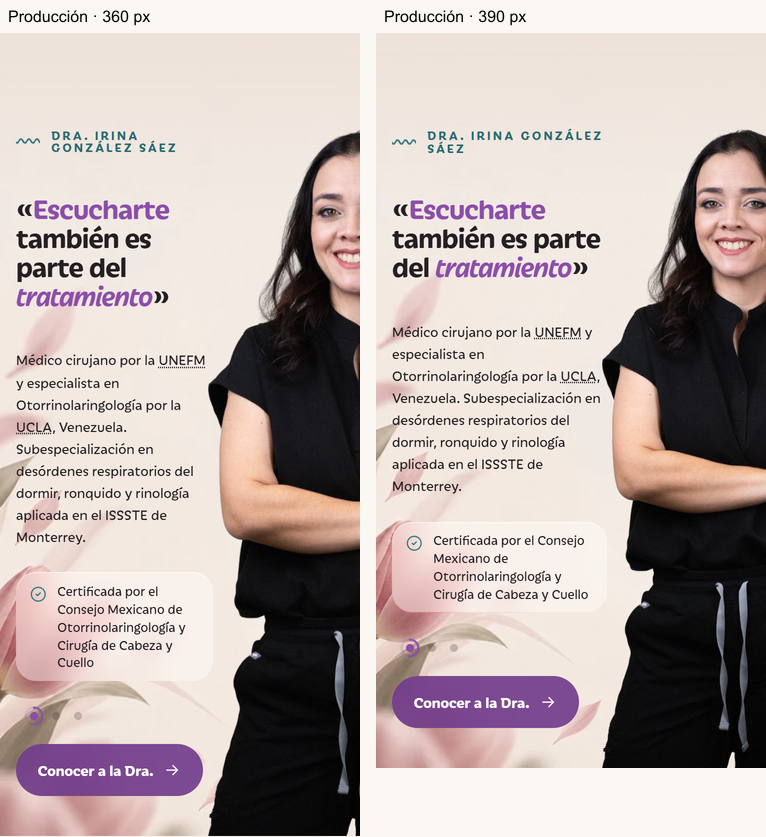

# Escucharte — por qué la vista estrecha sigue casi igual

José informa que la sección sigue casi igual en su teléfono, incluso en incógnito. Codex comprobó producción sin interceptar assets y con perfil móvil/DPR2. En las muestras de360/390 el sitio sí entrega el CSS60/40, versión1791651570; el navegador calcula grid60/40 y offset−5px. Esto verifica esas peticiones, no la caché o configuración efectiva del teléfono de José.

## Causa reproducida a360px

| Geometría | Antes, 4cf6e8e | Producción60/40 |
|---|---:|---:|
| Inicio del retrato | 207,672px | 207,797px |
| Alto del retrato | 707,750px | 707,750px |

El cambio desplazó la imagen **0,125px**: visualmente nada. El aumento de la columna de56 a60 % compensó el cambio de offset de+8 a−5px. La columna cumple el60/40, pero no produjo el acercamiento esperado en esta vista. Mi captura anterior a390px no era representativa del resultado a360px.

A390px, la posición cambia solo1,33px hacia la derecha; mejora el encuadre porque el texto ocupa menos líneas y el retrato baja de707,75 a638,97px. El retrato toma la altura de la fila: una línea extra de texto modifica su escala. Incógnito no modifica esta geometría.

## Propuesta concreta, todavía no aplicada

Conservar columnas, tipografía, figura y sección; mover **12px adicionales solo en360px o menos**. En el ensayo a360px el alto y ancho del retrato permanecen idénticos y no hay intersección del alfa con cajas de palabras del párrafo. El rostro estimado pasa de44,6 a54,8 %. Mover20/28px recupera más rostro, pero empieza a cruzarse con cajas del texto. A390px ese mismo desplazamiento de12px ya genera intersección, por eso no se propone aplicarlo a todos los móviles.

El offset total del PNG sería−17px respecto de la división. Esto sale del margen aproximado−2/−5 de D-061: **Claude debe plantear esta diferencia a José**, conforme a la instrucción de canalizar las preguntas por Claude. No se alteró el CSS del tema por inferencia. La propuesta está aislada en `tools/audit/narrow-position-proposal.css` y su captura se reproduce con `portrait-position.cjs --local --tag=narrow-position --offsets=0,12,20,28`.

La intersección mide cajas de palabras y alfa>64, no glifos ni certificación de contraste. Antes de aplicar habría que comprobar todas las credenciales y el rango estrecho, incluido320px. El criterio de rostro completo sigue retirado: se busca un desplazamiento visible conservando tamaño y legibilidad.

## Evidencia y siguiente paso

- `live-phone-css.json`: CSS y rectángulos obtenidos de producción, con UA Android en360/390.
- `columns-carousel-live.json`: perfil móvil/DPR2 a360/390/430/768; escritorio1440; tres tarjetas estables, un ítem activo, tres puntos, sin desborde ni errores JS/consola.
- `portrait-position/narrow-position-metrics.json`: ensayo local de desplazamientos adicionales, sin alterar producción.

Q-039 queda abierto por resultado en el teléfono. Claude presenta la propuesta a José y confirma el ancho/zoom real si hace falta; la sesión local compara esa misma vista antes/después. No sustituir esta comprobación por pedir limpiar caché, ni cerrar el hallazgo porque las proporciones CSS ya sean correctas. No hubo despliegue ni cambio del tema en esta unidad.
