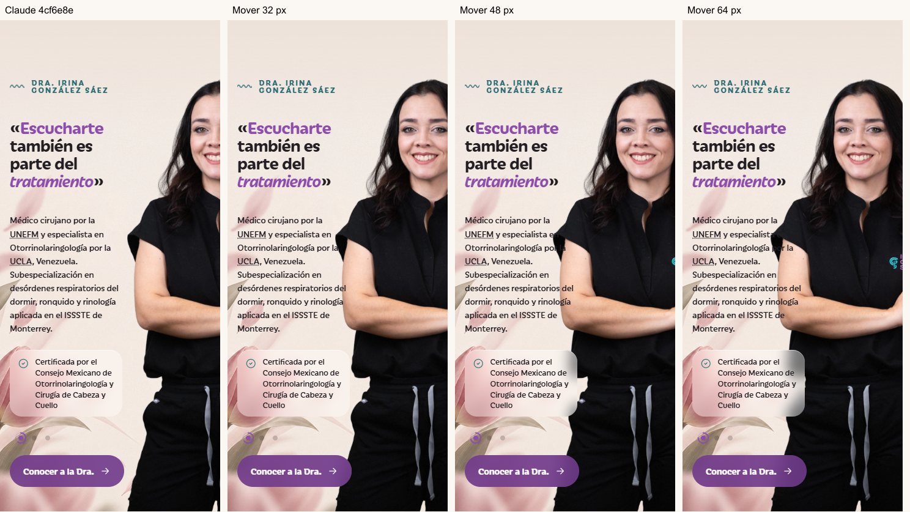
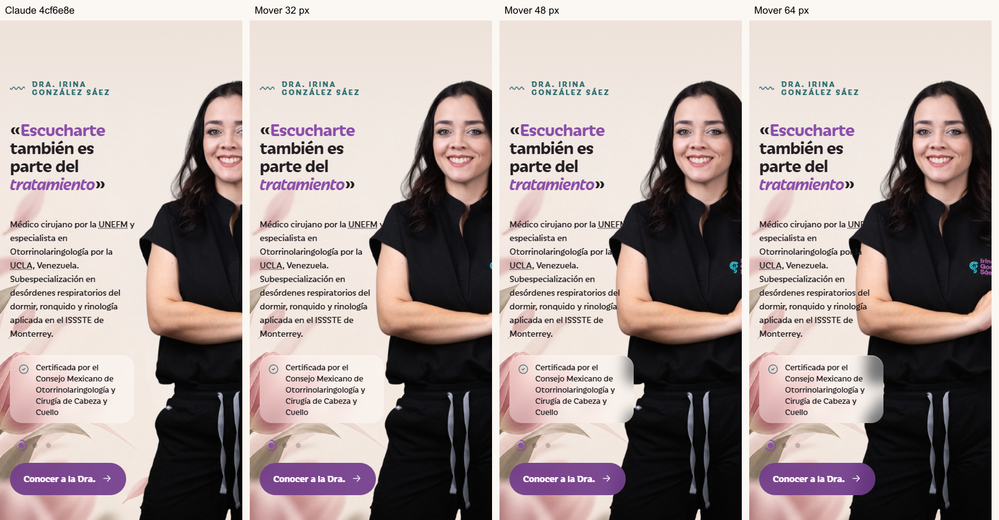

# Revisión de Escucharte tras la captura del propietario

La indicación nueva de José es conservar el tamaño del retrato y acercarlo al texto moviéndolo hacia la izquierda. Las variantes A/B que reducían la figura quedan como antecedentes, sin elección pendiente. José pidió que las preguntas las gestione Claude.

Mientras Codex preparaba pruebas, entró el commit de Claude `4cf6e8e`. Se conservó íntegramente y se revisó con el harness; Codex no modificó el CSS del tema. Solo se crearon pruebas, capturas y este relevo.

## Resultado de 4cf6e8e

**La corrección todavía no recupera suficiente rostro en 360–390 px.** La regla `components.css:316` acerca la caja del PNG de 16 a 8 px del texto: es un desplazamiento de 8 px respecto de la versión publicada, no de 8 px respecto del rostro. La silueta del torso y el rostro ocupan posiciones distintas dentro de la imagen.

| Ancho | Alto sección | Alto retrato | Gap de cajas | Rostro visible estimado |
|---:|---:|---:|---:|---:|
| 360 | 803,8 px | 707,8 px | 8 px | 44,7 % |
| 390 | 803,8 px | 707,8 px | 8 px | 56,0 % |
| 414 | 735,0 px | 639,0 px | 8 px | 81,3 % |
| 430 | 735,0 px | 639,0 px | 8 px | 88,0 % |
| 483 | 672,9 px | 576,9 px | 8 px | 100 % |
| 1440 | 849,0 px | 729,0 px | Escritorio | 100 % |

La figura sigue apoyada abajo, sin desborde de documento ni excepciones JS. El tamaño resulta del alto de la columna: no es una escala fija. Por ello, cambios de altura de tarjetas/fuentes también modifican el alto del retrato; no afirmar que todos los tamaños coinciden exactamente con la foto anterior.

## Ensayo de desplazamiento manteniendo el tamaño

Se movió únicamente la imagen en el navegador. Su alto/ancho, el texto y la sección quedaron idénticos dentro de cada ancho. Se liberó el recorte del contenedor de retrato para que este no ocultara la parte movida hacia la izquierda; el viewport sigue recortando por la derecha. Ninguno de estos ensayos modifica el tema ni se propone desplegarlo tal cual.

| Ancho | Desplazamiento adicional | Rostro estimado | Intersección de silueta con cajas de palabras del párrafo |
|---:|---:|---:|---:|
| 360 | 0 px | 44,7 % | 0 % |
| 360 | 32 px | 72,0 % | 1,0 % |
| 360 | 48 px | 85,7 % | 4,9 % |
| 360 | 64 px | 99,4 % | 10,5 % |
| 390 | 32 px | 83,3 % | 0,16 % |
| 390 | 48 px | 97,0 % | 2,0 % |
| 430 | 0 px | 88,0 % | 0 % |

Mover más recupera el rostro, pero introduce el hombro detrás del párrafo. Algunas letras quedan sobre la ropa negra y se pierden. Esto es una colisión de composición, no un error de tamaño del archivo. No aprobar un simple desplazamiento uniforme de 48/64 px en todos los anchos.

## Acción para Claude

Continuar la composición móvil conservando la figura grande. Evaluar una distribución del párrafo que deje libre la silueta, con el menor desplazamiento suficiente para cada ancho. No achicar otra vez la foto, ocultar texto, añadir sombras, recortar artificialmente el brazo ni cambiar menú/fondo/carrusel para ocultar el conflicto. Si el flujo del texto necesita una decisión visual, Claude se la presenta a José con esta evidencia.

Revisar especialmente las líneas junto al hombro y las credenciales glass. El gate sigue abierto a 360–390: rostro estimado ≥80 %, párrafo legible, escala acordada, anclaje inferior y una tarjeta/tres puntos/anillo. El despliegue y la elección de cualquier composición corresponden al flujo existente con Claude local y José.

## Reproducción y límites

- `node tools/audit/visual.cjs --local --variant=claude-4cf6e8e`: rectángulos a ocho anchos, assets locales sobre HTML publicado.
- `node tools/audit/portrait-position.cjs --local`: snapshot en memoria de CSS/components y JS/main, desplazamientos 0/32/48/64 a 360/390/430, imagen RGBA y cajas de palabras.
- Métricas: `audit/2026-10-10/claude-4cf6e8e-metrics.json` y `audit/2026-10-10/portrait-position/claude-metrics.json`. El ensayo publicado inicial queda en `portrait-position/metrics.json` como referencia anterior.

El rostro se estima con región x=30–65 % del PNG, sin cabello; no es reconocimiento facial. La intersección usa alfa >64 y muestrea cajas de palabras cada 2 px; es un indicador conservador de choque, no porcentaje de glifos ocultos ni medición WCAG. Las capturas respaldan el problema visual. No se leyó ni modificó ninguna credencial, no hubo envío de formulario, despliegue ni cambio clínico.
